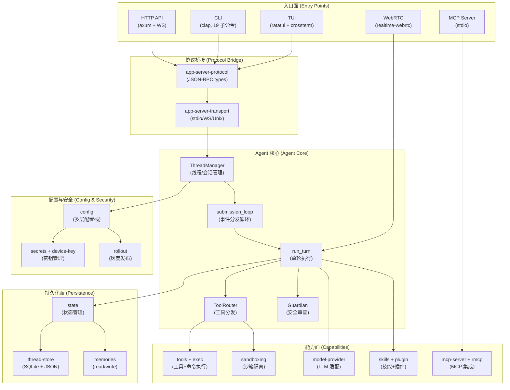

# 01 — 系统全景（System Landscape）

> [!IMPORTANT]
> 这一篇是 Codex 的"地图"——先看清全貌，再进入单个子系统。

> 读完这篇你应该能回答：Codex 由哪几层组成、进程怎么通信、108 个 crate 按什么逻辑分组。

## 1) 一句话先记住

Codex 是一个**以 Rust agent 核心为引擎、以终端为主要交互面、以 LLM 提供商为计算后端**的 AI 编程代理。它的核心循环跑在 Rust 侧，TUI/CLI/HTTP API/MCP 是四个对外接口面。

## 2) 技术栈

| 层 | 技术 | 说明 |
|----|------|------|
| Agent 核心 | Rust（tokio 异步运行时） | 主循环、工具分发、沙箱执行 |
| 前端（TUI） | Rust + ratatui + crossterm | 终端渲染、事件循环、JSON-RPC 桥接 |
| 前端（CLI） | Rust + clap | 命令行入口 + 19 个子命令 |
| 前端（HTTP） | Rust + axum | REST + WebSocket API 服务端 |
| 前端（Node.js） | TypeScript + Node.js | npm 包入口（`@openai/codex`），是启动 Rust 二进制的薄壳 |
| 构建 | Bazel（CI）+ Cargo（本地开发） | 双构建系统，workspace 定义在 `codex-rs/Cargo.toml` |
| 持久化 | SQLite（sqlx）+ JSON 文件 | Thread 状态、session 历史、rollout JSONL |
| 沙箱 | Landlock（Linux）、Seatbelt（macOS）、AppContainer（Windows） | 三层 OS 级隔离 |
| LLM 协议 | OpenAI Responses API + Anthropic Messages API | 多 provider 抽象层 |

## 3) Crate 地图：9 域 108 Crate

> 完整 crate 列表见 Phase 0 扫描：`_tmp_tracking/_digested_isuues/2026-05-03-phase0-crate-dependency-scan.md`

```
┌─────────────────────────────────────────────────────────────┐
│                    codex-cli/ (Node.js)                      │
│                   npm 包入口，薄壳启动器                        │
└──────────────────────────┬──────────────────────────────────┘
                           │ spawn Rust binary
   ┌───────────────────────┼───────────────────────────────────┐
   │                 codex-rs/ (108 crates)                    │
   │                                                           │
   │  ┌──────────────┐  ┌──────────────┐  ┌──────────────┐   │
   │  │  TUI (tui)   │  │ HTTP (app-   │  │  CLI (cli)   │   │
   │  │  ratatui      │  │  server)     │  │  clap + 19   │   │
   │  │  crossterm    │  │  axum + WS   │  │  subcommands │   │
   │  └──────┬───────┘  └──────┬───────┘  └──────┬───────┘   │
   │         │     JSON-RPC    │                   │           │
   │         └────────┬────────┘                   │           │
   │                  │                            │           │
   │         ┌────────┴────────────────────────────┴─────┐     │
   │         │          app-server (HTTP/WS API)          │     │
   │         │   app-server-protocol (JSON-RPC types)     │     │
   │         │   app-server-transport (stdio/WS/Unix)     │     │
   │         └──────────────────┬────────────────────────┘     │
   │                            │                               │
   │         ┌──────────────────┴──────────────────┐           │
   │         │          core (Agent 核心)            │           │
   │         │  session / run_turn / submission_loop │           │
   │         │  tools / guardian / sandboxing / exec │           │
   │         └──────────────────┬──────────────────┘           │
   │                            │                               │
   │    ┌───────┬───────────────┼───────────────┬──────────┐   │
   │    │       │               │               │          │   │
   │  ┌──┴──┐ ┌─┴─────┐  ┌────┴────┐  ┌───────┴──┐ ┌─────┴─┐ │
   │  │tools│ │model- │  │sandboxing│ │state/    │ │skills │ │
   │  │exec │ │provider│ │exec      │ │thread-   │ │plugin │ │
   │  │shell│ │models- │ │linux-    │ │store     │ │mcp    │ │
   │  │     │ │manager │ │sandbox   │ │memories  │ │       │ │
   │  └─────┘ └───────┘  └──────────┘ └──────────┘ └───────┘ │
   │                                                           │
   │  ┌──────────────────────────────────────────────────┐    │
   │  │  config (配置层) + utils/ (20 个工具库)            │    │
   │  └──────────────────────────────────────────────────┘    │
   └───────────────────────────────────────────────────────────┘
```

**9 域统计**：

| 域 | Crate 数 | 核心 crate |
|----|----------|-----------|
| Agent 核心 | 6 | `core`, `core-api`, `agent-identity`, `agent-graph-store` |
| 工具与执行 | 14 | `tools`, `exec`, `exec-server`, `sandboxing`, `shell-command` |
| 模型与提供商 | 10 | `model-provider`, `models-manager`, `ollama`, `lmstudio`, `chatgpt` |
| 技能与插件 | 4 | `skills`, `plugin`, `core-skills`, `core-plugins` |
| 状态与记忆 | 6 | `state`, `thread-store`, `memories/read`, `memories/write` |
| TUI/CLI/集成 | 21 | `tui`, `cli`, `app-server`, `mcp-server`, `rmcp-client`, `realtime-webrtc` |
| 配置与安全 | 10 | `config`, `secrets`, `device-key`, `rollout`, `network-proxy` |
| 基础设施 | 17 | `analytics`, `otel`, `hooks`, `feedback`, `cloud-tasks` |
| 通用工具库 | 20 | `utils/absolute-path`, `utils/pty`, `utils/cache`, 等 |

## 4) 进程模型

```
┌──────────────────────────────────────────────────────┐
│                   用户终端                             │
│                                                     │
│  $ codex                        $ codex exec        │
│  $ codex app-server             $ codex mcp-server   │
│           │                            │              │
└───────────┼────────────────────────────┼──────────────┘
            │                            │
    ┌───────┴────────┐          ┌────────┴─────────────┐
    │  Node.js 薄壳    │          │  Rust binary 直接启动  │
    │  bin/codex.js   │          │  (codex exec, 等)    │
    │       │         │          └──────────────────────┘
    │  spawn native   │
    │  binary         │
    └───────┬─────────┘
            │
    ┌───────┴──────────────────────────────────────────┐
    │            codex (Rust binary)                    │
    │                                                   │
    │  cli_main() / MultitoolCli::parse()              │
    │       │                                           │
    │       ├── 无子命令 → run_interactive_tui()        │
    │       │     └── codex_tui::run_main()             │
    │       │           └── 启动 app-server (内置)       │
    │       │                 └── TUI 通过 JSON-RPC 通信  │
    │       │                                           │
    │       ├── exec → run_exec_main()                  │
    │       ├── app-server → run_app_server()           │
    │       ├── mcp-server → run_mcp_server()           │
    │       └── 其他 15 个子命令...                      │
    └───────────────────────────────────────────────────┘
```

**三种进程拓扑**：

| 模式 | 进程数 | 通信方式 | 场景 |
|------|--------|---------|------|
| 交互式 TUI | 1 | 内置 app-server，JSON-RPC over stdio/WS | `codex`（默认） |
| 非交互式 | 1 | 直接调用，无长连接 | `codex exec`、`codex review` |
| 守护进程 | 1+ | HTTP + WebSocket（app-server） | `codex app-server`、远程 TUI |
| MCP 模式 | 1 | stdio（MCP 协议） | `codex mcp-server` |

> [!NOTE]
> 交互式 TUI 模式会内部启动一个 app-server 实例（HTTP + WebSocket），TUI 通过 `app-server-client`（JSON-RPC）与之通信。这种进程内嵌入的架构避免了额外的进程管理开销。

## 5) 主子系统关系（Mermaid）



## 6) 系统约束

| 约束 | 说明 | 影响 |
|------|------|------|
| Prompt caching | Anthropic 有 5 分钟 cache TTL，system prompt 必须冻结 | 影响 context 注入时机和 system prompt 变更策略 |
| Sandbox 跨平台 | Linux Landlock / macOS Seatbelt / Windows AppContainer 三种完全不同的实现 | `sandboxing` 定义抽象层，各 OS 独立实现 |
| 双构建系统 | Bazel（CI）+ Cargo（本地开发）并存 | Cargo.toml 和 BUILD 文件需保持同步 |
| Node.js 薄壳 | npm 包 `@openai/codex` 只是一个平台检测 + spawn | 真正的逻辑全部在 Rust 侧 |
| 流式响应 | 模型输出通过 `EventMsg` 逐 token 推送到前端 | 所有前端必须支持 SSE/WebSocket 流式消费 |
| Approval 安全链 | 高危操作必须经过 Guardian（LLM 审查）+ 用户确认两道闸门 | `AskForApproval` 枚举定义了完整策略谱 |

## 7) 源码抓手（Source Code Handholds）

| 想看什么 | 从哪里开始 |
|----------|-----------|
| Workspace 完整定义 | `codex-rs/Cargo.toml` |
| TUI 主入口 | `codex-rs/tui/src/main.rs` |
| CLI 入口 + 命令分发 | `codex-rs/cli/src/main.rs`、`codex-rs/cli/src/lib.rs` |
| App-server 主入口 | `codex-rs/app-server/src/main.rs` |
| Agent 核心循环 | `codex-rs/core/src/session/turn.rs` → `run_turn()` |
| 事件分发循环 | `codex-rs/core/src/session/handlers.rs` → `submission_loop()` |
| 会话管理 | `codex-rs/core/src/session/mod.rs` → `Codex` struct |
| 工具分发 | `codex-rs/core/src/tools/router.rs` → `ToolRouter` |
| 模型抽象 | `codex-rs/model-provider/src/lib.rs` |
| 沙箱抽象 | `codex-rs/sandboxing/src/lib.rs` |
| 配置加载链 | `codex-rs/config/src/loader/mod.rs` → `load_config_layers_state()` |
| Node.js 入口 | `codex-cli/bin/codex.js` |
| 协议类型 | `codex-rs/protocol/src/protocol.rs` → `Op` / `EventMsg` |
| JSON-RPC 协议 | `codex-rs/app-server-protocol/src/protocol/` → `ClientRequest` / `ServerNotification` |

## 8) 相关文档

- Phase 0 crate 详细扫描：`_tmp_tracking/_digested_isuues/2026-05-03-phase0-crate-dependency-scan.md`
- 信息流与模块边界：`02-information-flow-and-boundaries.md`
- Agent 核心循环：`03-agent-core/01-agent-loop-and-lifecycle.md`（待生产）

---

> 读完这篇，你应该能对着 crate 地图找到任意子系统的大致位置。如果想了解数据在子系统间怎么流转，继续看 `02-information-flow-and-boundaries.md`。
