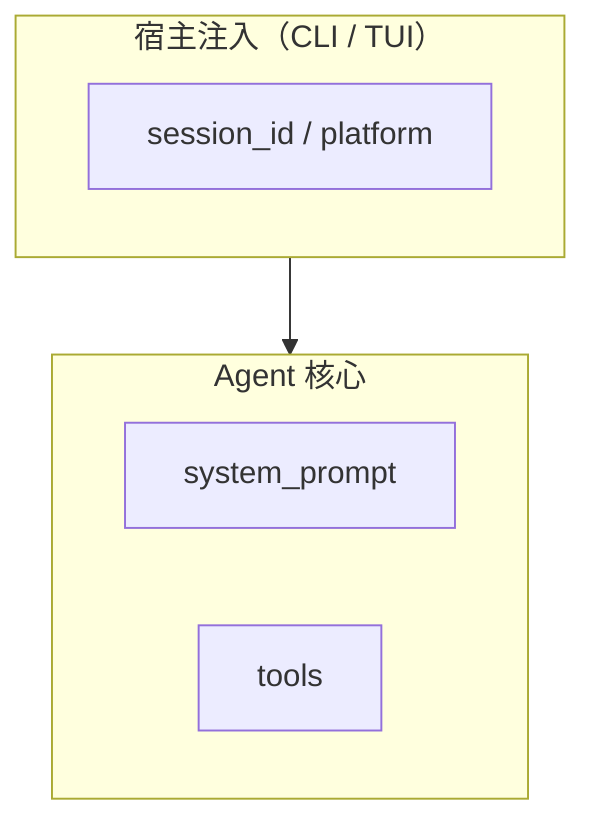

# _digested 写作风格指南

本文是从 Hermes-Agent `_digested` 的优秀实践中提取的写作规范。目标是让每一篇 `_digested` 文档都具备同等的信息密度和可操作性。

---

## 核心原则

1. **源码是唯一真相源**，`_digested` 只是"源码已经是这样的"事实整理
2. **每一句话都应该携带信息**，删掉一切可以删掉而不影响理解的词
3. **面向任务，而非面向目录** — 读者带着问题来，应能在 30 秒内定位到答案
4. **正文自包含** — 不假设读者读过其他 `_digested` 文档
5. **结论先行** — 先给 TL;DR 心智模型，再展开细节，不要层层铺垫

---

## 一、主题文档的标准骨架（doc_type: topic）

每篇主题文档按以下顺序组织：

```markdown
---
[front matter]
---

# 标题 — 中英文对照，点明这条链路

> 面向读者：一句话说明谁该读这篇。
> 目标：一句话说明这篇覆盖什么。

不覆盖：明确排除什么。

---

## 1) [概念框架 — 一张图 / 一句话 / 先分清N件事]
## 2) [第一条机制解释]
### 2.1 [子主题]
## 3) ~ 7) [逐层加深细节]
## N-2) [排错/坑 — 一眼排查卡 或 最容易踩的坑]
## N-1) 源码抓手 / 源码 tests 抓手
## N) 相关文档
```

### 1.1 开篇技巧（六选一或多选组合）

**技巧 A — blockquote 定向**（最常用）：
```
> 面向读者：想先从"系统整体长什么样"入手，再决定往哪个子系统深挖的人。
> 目标：把 Codex 的运行时、主组件、关键入口压成一张高密度全景图。

不覆盖：具体单条链路的时序细节；这里只做全景图。
```

**技巧 B — 段落式读者定位**（用于复杂的机制文档）：
```
面向读者：已经能读 Codex 的主要模块，想进一步搞清楚：
- Agent 是怎么一轮轮调用模型 + 工具的
- 为什么会"突然停了"
...
本文目标：以源码与 tests 为准，把核心 loop 讲清楚...
```

**技巧 C — callout-block-first**（仅用于 Beginner 层，见第五节）

**技巧 D — "先记住一句话"**（用于复杂链路）：
```
## 1) 先记住一句话
`codex-rs/core/src/agent.rs` 是 agent loop 的入口...
```

**技巧 E — "一张图先看全局"**（用于系统全景或跨模块链路）：
```
## 1) 一张图先看全局
[mermaid flowchart]
```

**技巧 F — "先分清 N 件事"**（用于容易混淆的概念群）：
```
## 1) 先分清四件事
1. **toolset** — 配置层，决定哪些 tool name 进入候选集合
2. **tool schema** — 最终喂给模型的 tools 列表
3. **dispatch** — 模型真的调 tool 时，代码走哪条执行路径
4. **availability** — banner / doctor 之类的粗粒度提示
```

### 1.2 文档关闭顺序（不可变）

关闭部分必须按以下顺序出现：

1. **排错 / 坑** — `## N-2) 一眼排查卡` 或 `## N-2) 最容易踩的坑`
2. **源码抓手** — `## N-1) 源码抓手`（含测试路径）
3. **相关文档** — `## N) 相关文档`
4. **可选 `---` 水平线收尾**

---

## 二、索引文档的标准骨架（doc_type: index）

```markdown
---
[front matter]
---

# 0X — 主题名 索引

> 一句话说明这一层的定位。

> 这一层的默认目标：[3-4 条]。

## 怎么读这一层

| 你的状态 | 先读哪些 |
|---|---|
| ... | ... |

## 推荐阅读路径

### 路线 A：...
### 路线 B：...

## 计划文档 / 目录

1. `01-xxx.md` — 一句话
2. `02-xxx.md` — 一句话

## 这一层最适合承载什么
## 这一层故意不展开什么
```

---

## 三、编号规范

**不可变规则**：

- 顶层节：`## N)` — N 从 1 开始，使用右括号，不用点号
- 二层节：`### N.M` — 使用点号，不用括号
- 三层节：`#### N.M.K`
- 四层节（极少用）：`##### N.M.K.L`

```
✅ ## 1) 一张图先看全局
✅ ### 1.1 数据面 vs 控制面
✅ #### 1.1.1 具体机制

❌ ## 1. 概述           （不用点号 + 括号混用）
❌ ## 一、概述           （不用中文数字）
```

节标题应有信息量：
```
❌ "概述"、"介绍"、"背景"
✅ "2) 工具是怎么'被发现'的（discover）"
✅ "### 2.1 built-in tools"
```

---

## 四、Callout 用法（五种）

### 4.1 GitHub 风格 admonitions

| Callout | 用途 | 只用在哪里 |
|---------|------|-----------|
| `> [!TIP]` | 省时建议、最佳实践 | Beginner 层大量使用，主题文档少用 |
| `> [!IMPORTANT]` | 关键指令、固定顺序 | Beginner 层大量使用 |
| `> [!NOTE]` | 术语澄清、概念说明 | 所有层 |
| `> [!WARNING]` | 陷阱、常见误解 | 所有层 |

### 4.2 裸 `>` blockquote

**仅用于文档开篇的读者/目标定位**，不用于正文中。正文中的强调用 admonitions。

### 4.3 Bold 强调

关键术语首次引入时用 `**粗体**`：
```
**AIAgent** 实例可以粗分为 3 层
**thread-scoped** interrupt 不会跨线程传播
```

### 4.4 术语中英文对照

专有术语首次出现必须是 `中文（English）`：
```
工具分发（tool dispatch）
会话持久化（session persistence）
提示词缓存（prompt caching）
```

同一文档后续出现可只用中文。Beginner 层对术语对照要求更严格（每次出现都应标注）。

---

## 五、Beginner 层的特殊风格

`01-beginner/` 的文档和其他主题文档有显著差异：

1. **开篇 callout 堆叠**：正文开始前可能有 2-3 个叠放的 `> [!TIP]` / `> [!IMPORTANT]` / `> [!NOTE]`
2. **术语对照更严格**：每次出现专有术语都标注「中文（English）」
3. **止步提示**：文末有 "停在这里也已经够用" 告诉读者不必往下深挖
4. **验证检查表**：用 3 列表格（检查项 / 最短命令 / 成功信号）确认读者能操作
5. **"1分钟诊断卡"**：快速分流表（现象 → 先看哪里 → 深层文档）
6. **更多命令示例**：直接可复制粘贴的 shell 命令

---

## 六、十种表格原型

### 6.1 症状→抓手排查表（3 列）
```
| 症状 | 第一抓手 | 高概率原因 |
|---|---|---|
| 启动就退出 | `errors.log` | provider/key 配置错误 |
```

### 6.2 现象→先查表（3 列）
```
| 故障场景 | 先查什么 | 对应深层文档 |
|---------|---------|------------|
```

### 6.3 按任务跳转表（2 列）
```
| 你的状态 | 先读哪些 |
|---|---|
| 我现在只想先跑通 | `01-quickstart.md` |
| 我要改 agent 核心 | `03-agent-core/01-agent-loop.md` |
```

### 6.4 选型决策表（3 列）
```
| 你要做的事 | 推荐落点 | 为什么 |
|---|---|---|
```

### 6.5 验证检查表（3 列）
```
| 检查项 | 最短命令 | 成功信号 |
|---|---|---|
```

### 6.6 控制点矩阵（4 列）
```
| 控制点 | Host App 必须做 | Codex 已提供 | 备注 |
|---|---|---|---|
```

### 6.7 风险评级表（3 列）
```
| 工具/能力 | 风险 | 默认建议 |
|---|---|---|
```

### 6.8 对比表（多列）
```
| 维度 | 旧口径 | 新口径 |
|---|---|---|
```

### 6.9 枚举定义表（3 列）
```
| 分类 | 枚举值 | 含义 |
|---|---|---|
```

### 6.10 速查表（2 列）
```
| 路径 | 含义 |
|------|------|
| `codex-rs/core/` | Agent 核心 |
```

**表的使用规则**：
- 单元格不超过 3 行文字
- 不放代码块
- 如果有 5+ 行同类信息，优先考虑用表

---

## 七、源码路径的写法

### 文件路径：始终用相对路径 + inline code

```markdown
`codex-rs/core/src/agent.rs`
`codex-rs/tui/src/app.rs`
`codex-cli/bin/codex`
```

### 函数/结构体锚定：用冒号连接

```markdown
`codex-rs/core/src/agent.rs:Agent::run_conversation()`
`gateway/platforms/base.rs:BasePlatformAdapter.handle_message`
```

### 测试路径：成对列出

```markdown
测试（建议当"规格书"读）：
- `codex-rs/core/tests/agent_tests.rs`
  - `test_agent_loop_interrupt`：覆盖中断传播
  - `TestPerThreadInterruptIsolation`：验证线程隔离
```

**为什么**：让读者能立刻验证文档论断，而不是"信了就信了"。

---

## 八、Mermaid 图的原则

### 用三种类型

1. **flowchart TD** — 系统全景、分层架构
2. **flowchart LR** — 数据流、管道
3. **sequenceDiagram** — 端到端时序

### 写法约定



要点：
- 用 `subgraph` 给逻辑分组，标签中英文对照
- 节点名用源码里的真实标识符
- 只画关键流，不画每一条可能的路径
- 通常配一个等价的 ` ```text ` 图作为渲染失败时的回退

---

## 九、深度梯度

每篇主题文档的信息密度应按以下曲线分布：

| 位置 | 内容 | 密度 |
|------|------|------|
| **顶部**（前 1-2 节） | 概念框架：全景图、心智模型、分类 | 低密度，高概念负载 |
| **中部**（节 2-6） | 机制解释：代码路径、数据结构、边界条件 | 最高密度，最多源码引用 |
| **下部**（节 N-2） | 排错/坑：症状表、常见陷阱 | 中密度，面向行动 |
| **底部**（节 N-1, N） | 源码抓手 + 相关文档 | 低密度，纯引用 |

---

## 十、"Why vs What" 比例规则

| 文档类型 | Why 比例 | 说明 |
|---------|---------|------|
| **机制文档**（agent loop、dispatch、error classify） | 高 | 每解释一个 What 就给一个 Why |
| **架构文档**（system landscape、info flow） | 中 | 在系统约束处给 Why |
| **入门文档**（quickstart、logs） | 低 | 以 What/How 为主，Why 只在关键决策点给 |
| **安全/集成文档** | 中 | 在"谁负责什么"处给 Why |

Why 的惯用句型：
```
为什么必须 thread-scoped：...
原因很简单：...
含义：...
这是刻意设计：...
目的是：...
避免...（用在解释约束时）
```

---

## 十一、交叉引用规范

### 同目录引用
```markdown
- 中文描述：`NN-short-name.md`
```

### 跨目录引用
```markdown
- 中文描述：`../NN-category/NN-short-name.md`
```

### 规则
- 只在 README 和 `相关文档` 节做交叉引用
- 主题正文不假设读者读过其他 `_digested` 文档
- 数字前缀始终匹配目标文档的编号

---

## 十二、front matter 字段使用约定

```yaml
---
title: "NN — 中文标题（English）"  # 索引页和主题页都这样写
doc_type: "index|topic|context|archive|meta-convention"
status: "current|archive|in_progress"
branch: "ethan"
updated: "YYYY-MM-DD"
audience: "一句话，具体到人"
purpose: "一句话，这篇文档存在的理由"
owns: "精确描述这篇文档覆盖的边界——以后判断哪篇该改全靠它"
update_when:         # 具体的机械判断条件，不是"需要更新时"
  - "XX机制发生变化时"
  - "新增YY入口时"
out_of_scope:        # 硬边界，阻止 scope creep
  - "ZZ的实现细节"
  - "历史归档记录"
# sync_status 可选——仅在上游同步复核后追加
sync_status:
  source: "upstream-sync"
  baseline_ref: "origin/main"
  baseline_before: "<short hash>"
  baseline_after: "<short hash>"
  state: "updated|reviewed_no_change|unknown"
---
```

---

## 十三、信息密度自检清单

写完一篇文档后：

1. [ ] 读者 30 秒扫完 TL;DR / 第一节能拿到全部关键概念吗？
2. [ ] 每个技术术语首次出现都有「中文（English）」吗？
3. [ ] 每个论断都能追溯到具体的源码路径或测试路径吗？
4. [ ] 有没有可以删掉而不影响理解的句子？
5. [ ] 有没有可以用表格替掉的冗长列举？
6. [ ] front matter 的 `owns` 能准确描述这篇文档的责任边界吗？
7. [ ] `out_of_scope` 能拦住明显不该写进这篇的内容吗？
8. [ ] 如果读者只读这一篇（不读其他 `_digested`），能独立理解吗？
9. [ ] 有排错/坑节（一眼排查卡或最容易踩的坑）吗？
10. [ ] 有关闭用的源码抓手 + 相关文档节吗？
11. [ ] 编号格式是 `## N)` 而不是 `## N.` 吗？

---

## 十四、与 README 维护契约的关系

- 本文是**风格规范**（怎么写）
- `README.md` 维护契约是**体系规范**（怎么组织、怎么对齐、sync_status 怎么用）
- `_skills/codex-progressive-sync/SKILL.md` 是**工作流规范**（怎么执行一次上游同步）
- 三者互补，所有 `_digested` 撰稿者都应遵循
