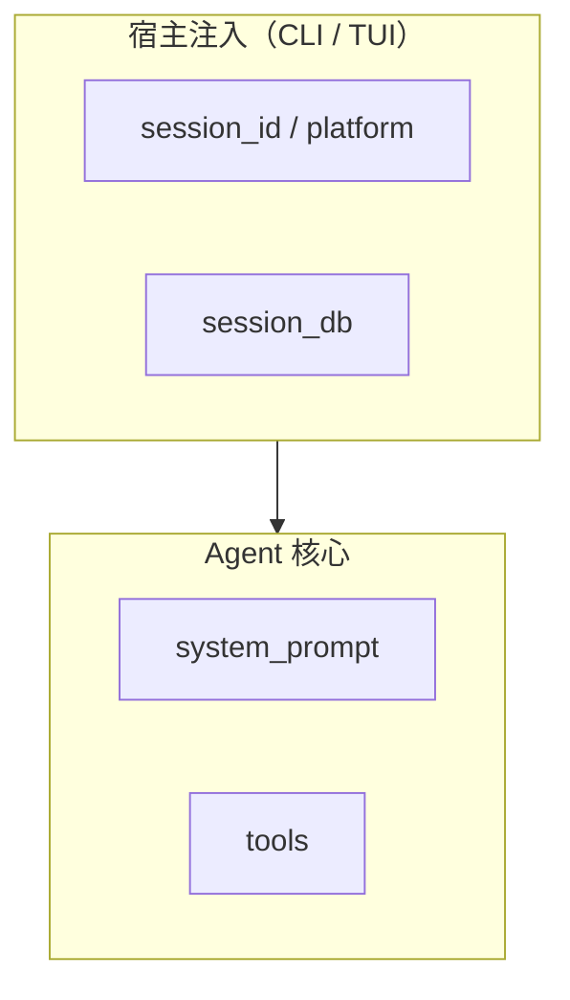

# _digested 写作风格指南

本文是从 Hermes-Agent `_digested` 的优秀实践中提取的写作规范。目标是让每一篇 `_digested` 文档都具备同等的信息密度和可操作性。

---

## 核心原则

1. **源码是唯一真相源**，`_digested` 只是"源码已经是这样的"事实整理
2. **每一句话都应该携带信息**，删掉一切可以删掉而不影响理解的词
3. **面向任务，而非面向目录** — 读者带着问题来，应能在 30 秒内定位到答案
4. **正文自包含** — 不假设读者读过其他 `_digested` 文档

---

## 一、文档结构模板

### 主题文档（doc_type: topic）的推荐骨架

```markdown
---
[front matter]
---

# 标题（中英文对照，点明这条链路是什么）

面向读者：一句话说明谁该读这篇。

本文重点：一句话说明这篇覆盖什么。

---

## TL;DR（先给一张 mental model）

[一段话 + 可选 mermaid 图，让读者 30 秒内拿到全部关键概念]

---

## 关键抓手（源码/测试）

源码入口：
- `path/to/file.rs`
  - `关键函数或结构体`：一句话说明它做什么

测试（建议当"规格书"读）：
- `tests/path/`
  - `TestSomething` / `test_xxx`：覆盖什么行为

---

## 1) 第一个主题

### 1.1 子主题

正文...

---

## 相关文档

- [只列真正的下一步阅读，不做网状交叉引用]
```

### 索引文档（doc_type: index）的推荐骨架

```markdown
---
[front matter]
---

# 0X — 主题名 索引

> 一句话说明这一层的定位。

> 这一层的默认目标：[3-4 条]。

## 怎么读这一层

| 你的状态 | 先读哪些 |
|---|---|
| ... | ... |

## 计划文档 / 目录

1. `01-xxx.md` — 一句话
2. `02-xxx.md` — 一句话

## 这一层最适合承载什么
## 这一层故意不展开什么
```

---

## 二、语言规范

### 术语：中英文对照，首次必写

```
工具分发（tool dispatch）
会话持久化（session persistence）
技能系统（skill system）
```

**为什么**：中文可能翻译跑偏，保留英文原词确保与源码对得上。同一篇文档内，首次出现写全「中文（English）」，后续可只用中文。

### 段落：短而密

- 一个段落只说一件事
- 超过 6 行的段落几乎一定可以拆
- 用 `**粗体**` 标记关键概念，方便扫读

### 标题：有信息量

```
❌ 不好："概述"、"介绍"、"背景"
✅ 好："2) 工具是怎么'被发现'的（discover）"
✅ 好："### 2.1 built-in tools"
```

---

## 三、表格的使用场景

### 适合用表格的地方

1. **按任务跳转**："我想做 X → 读这篇"
2. **故障分流**："遇到 X 现象 → 先查 Y → 深层文档 Z"
3. **速查表**："路径 → 含义"
4. **对比表**："旧口径 → 新口径"

### 不适合用表格的地方

- 长段落解释（表格单元格不超过 3 行）
- 代码块

---

## 四、源码路径的写法

### 总是写完整路径

```markdown
- `codex-rs/core/src/agent.rs`
  - `Agent::run_conversation()`：主 tool loop 入口
```

### 总是写对应的测试路径

```markdown
测试（建议当"规格书"读）：
- `codex-rs/core/tests/agent_tests.rs`
  - `test_agent_loop_interrupt`：覆盖中断传播
```

**为什么**：让读者能立刻验证文档论断，而不是"信了就信了"。

---

## 五、Mermaid 图的原则

### 什么时候用

- 系统全景图（组件 + 数据流）
- 分层架构（宿主 → Agent → 工具层）
- 流程对比（旧流程 vs 新流程）

### 什么时候不用

- 能用一句话说清的简单关系
- 纯线性的 1→2→3 流程（文字更清晰）

### 写法



要点：
- 用 `subgraph` 给逻辑分组命名
- 节点名用源码里的真实标识符
- 箭头只画关键流，不画每一条可能的路径

---

## 六、update_when 的写法

不是"需要更新时更新"，而是写**具体的触发条件**：

```yaml
# ❌ 不好
update_when:
  - "需要更新时"

# ✅ 好
update_when:
  - "工具注册或分发机制变化时"
  - "新增或移除主要入口时"
  - "Agent 核心循环或生命周期发生重大变化时"
```

**为什么**：让维护者（或 Agent）能机械判断"这次改动是否需要动这篇文档"，而不是靠感觉。

---

## 七、out_of_scope 的写法

不是摆设，是**阻止 scope creep 的硬边界**：

```yaml
# ✅ 好
out_of_scope:
  - "单个工具的业务逻辑"
  - "TUI/CLI 的交互实现"
  - "历史归档记录"
```

**为什么**：当有人想往里塞不属于这篇的内容时，`out_of_scope` 是拒绝的依据。

---

## 八、信息密度的自检清单

写完一篇文档后，逐条过：

1. [ ] 读者 30 秒扫完 TL;DR 能拿到全部关键概念吗？
2. [ ] 每个技术术语首次出现都有「中文（English）」吗？
3. [ ] 每个论断都能追溯到具体的源码路径或测试路径吗？
4. [ ] 有没有可以删掉而不影响理解的句子？
5. [ ] 有没有可以用表格替掉的冗长列举？
6. [ ] front matter 的 `owns` 能准确描述这篇文档的责任边界吗？
7. [ ] `out_of_scope` 能拦住明显不该写进这篇的内容吗？
8. [ ] 如果读者只读这一篇（不读其他 `_digested`），能独立理解吗？

---

## 九、与 README 维护契约的关系

- 本文是**风格规范**（怎么写）
- `README.md` 维护契约是**体系规范**（怎么组织、怎么对齐、sync_status 怎么用）
- 两者互补，所有 `_digested` 撰稿者都应遵循
